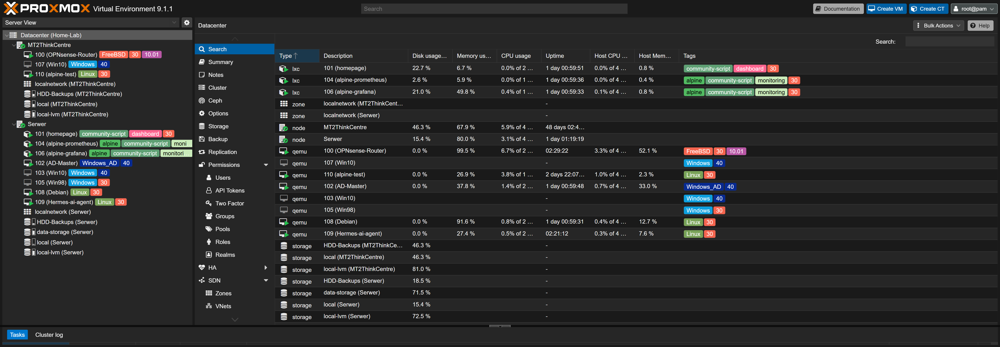
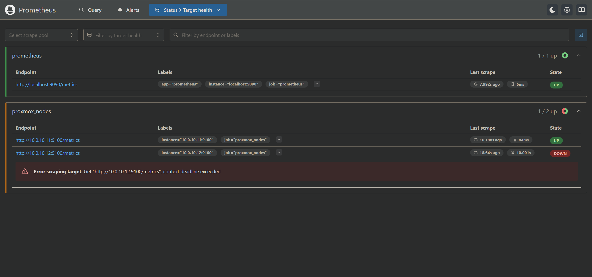
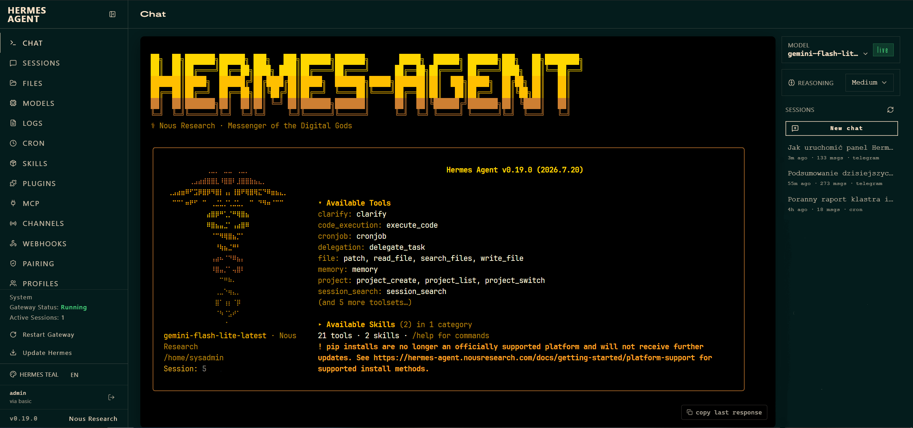

# ⚡ Enterprise-Grade Proxmox HA Homelab & Infrastructure

> **Production-grade, highly available hybrid infrastructure** emulating enterprise corporate networks. Designed from scratch with strict L2/L3 security segmentation, hybrid-cloud quorum arbitration, automated telemetry, and custom AI-driven ChatOps.

---

### 🎯 Key Engineering Highlights (At a Glance)

| Capability | Implementation Details |
| :--- | :--- |
| **High Availability & Quorum** | 2-Node Proxmox VE physical cluster secured against split-brain via external Oracle Cloud VPS **Corosync QDevice** over WireGuard. |
| **Network Security & Routing** | Virtualized **OPNsense** appliance, Router-on-a-Stick, 802.1Q VLANs (`MGMT`, `LAN`, `Proxmox`, `AD`) and Unbound DNS filtering. |
| **Identity & Access Management** | **Active Directory Domain Services (AD DS)** lab on Windows Server 2022 + Windows 10 clients with granular GPO policies and DNS. |
| **Observability & ChatOps** | End-to-end metrics via **Prometheus + Node Exporter + Grafana**, Homepage dashboard with RBAC tokens, and an autonomous AI management agent (`Hermes`) with Telegram alerts. |
| **Storage & Reliability** | Mirrored storage redundancy, dedicated VZDump backup pools, and Alpine Linux LXC footprint optimization. |

---
## 🌐 Network Architecture & VLAN Breakdown

The network operates on a **Router-on-a-Stick** topology with a virtualized **OPNsense** appliance handling inter-VLAN routing, stateful firewall inspection, and Kea DHCP services. Physical trunking and access switching are managed via an 8-port **TP-Link TL-SG108E (Smart Managed)** switch and Proxmox VLAN-aware Linux bridges (`vmbr0`).

---

### 📊 Subnet Allocation & VLAN Matrix

| VLAN ID | Name / Purpose | Subnet / CIDR | Gateway (OPNsense) | Switch Ports (TL-SG108E) | Description / Assigned Workloads |
| :---: | :--- | :--- | :---: | :--- | :--- |
| **10** | `MGMT` | `10.0.10.0/24` | `10.0.10.1` | Port 1 (Untagged, PVID 10) | Node 1 (Lenovo `.11`), Node 2 (Dell `.12`), Admin PC, Management UIs |
| **20** | `LANDOM` | `10.0.20.0/24` | `10.0.20.1` | Ports 4–7 (Untagged, PVID 20) | Trusted home client devices, Wi-Fi APs, Smart TVs |
| **30** | `PROXMOX` | `10.0.30.0/24` | `10.0.30.1` | Trunked on Host Bridge | Internal VMs, LXC containers, Prometheus, Grafana, App Workloads |
| **40** | `AD-LAB` | `10.0.40.0/24` | `10.0.40.1` | Isolated Virtual Segment | Windows Server 2022 (Domain Controller / DNS), Windows 10 Workstations |
| **99** | `WAN` | ISP DHCP / Static | ISP Gateway | Port 8 (Untagged, PVID 99) | Direct bridge to ISP Modem / Gateway (Funbox) |

---

### 🔒 Firewall Security Posture & Routing Policies

* **Default Deny Rule:** Strict inter-VLAN traffic isolation by default; all cross-segment communications require explicit stateful rules.
* **MGMT Isolation:** VLAN 10 access restricted exclusively to the primary administration workstation. Hypervisor web GUIs and SSH endpoints are unreachable from other VLANs.
* **AD Lab Sandboxing:** VLAN 40 (`AD-LAB`) is isolated from home infrastructure (VLAN 20) to prevent broadcast pollution and DNS poisoning, while maintaining controlled outbound WAN access for updates.
* **Hardware Offloading:** In-kernel Hardware Offloading features (`CRC`, `TSO`, `LRO`) are disabled within the virtualized OPNsense instance to prevent virtio-net packet corruption and maximize throughput stability.
* **DNS Resolution & Filtering:** Centralized **Unbound DNS** enforcing upstream DoT/DNSSEC and threat intelligence blocklists, supplemented by local Active Directory DNS forwarders for domain resolution.

## 🖥️ Hardware Specifications

| Device | Model | CPU | RAM | Storage |
| :--- | :--- | :--- | :--- | :--- |
| **Node 1** | Lenovo ThinkCentre M73 | Intel Core i3-4130T (2 Cores @ 2.9GHz) | 16GB DDR3| 120GB SSD |
| **Node 2** | Dell OptiPlex 5050 | Intel Core i5-6500 (4 Cores @ 3.2GHz) | 16GB DDR4 | 256GB SSD + 2TB HDD |
| **Network**| TP-Link TL-SG108E (Smart Managed) | - | - | - |

## ⚙️ Software & Configuration

### Node 1:  ThinkCentre M73
| ID | Name | Type | OS | Description |
| :--- | :--- | :--- | :--- | :--- |
| **100** | OPNsense-Router | VM | FreeBSD | Firewall |
| **107** | Win10 | VM | Windows 10 | guest system |
| **110** | alpine-test | VM | Linux | lightweight linux system test |

### Node 2: Serwer
| ID | Service/Name | Type | OS | Note |
| :--- | :--- | :--- | :--- | :--- |
| **101** | homepage | LXC | Alpine Linux | Cluster information monitoring |
| **104** | alpine-prometheus | LXC | Alpine Linux | Monitoring Database (Community Script) |
| **106** | alpine-grafana | LXC | Alpine Linux | Monitoring Visualization (Community Script) |
| **102** | AD-Master | VM | Windows Server 2022 | Windows Active Directory |
| **103** | Win10 | VM | Windows 10 | guest system |
| **105** | Win98 | VM | Windows 98 | retro system |
| **108** | Debian | VM | Debian 12 | Media Server |
| **109** | Hermes-ai-agent | VM | Debian 12 | My ai agent environment |

---

### UPDATE 14.03.2026r

* I made major improvements in my homelab security and infrastructure. Added **OPNsense** as a VM on my node 2.

---

### UPDATE 15.03.2026r

* Configured **Unbound DNS** on OPNsense to act as a network-wide ad, tracker, and malware blocker.
* Installed and configured the **CrowdSec** plugin on OPNsense. It automatically fetches global threat intelligence lists, instantly blocking known attackers and malicious IP addresses from around the world directly at the firewall level.

---

### UPDATE 20.05.2026r

* **Environment Reinstallation:** Clean installation of the hypervisor (**Proxmox VE**) on both cluster nodes (**Lenovo ThinkCentre M73** and **Dell Optiplex 5050**).
* **Network Services Isolation:** Migration of the core virtual machine (**OPNsense router**) to the dedicated Lenovo M73 node. Separating the base network from resource-intensive VMs protects routing from downtime during restarts of the second node and improves hardware resource allocation.
* **Active Directory Lab:** Deployment of a test environment featuring **Windows Server 2022** and **Windows 10** for learning Active Directory (new machines assigned to **VLAN 40** by default).
* **Monitoring Optimization:** Rebuild of the node monitoring containers. Migration of LXC containers to lightweight **Alpine Linux** base images, which significantly reduced resource consumption compared to default distributions.

---

### UPDATE 21.05.2026r

* **RAID 1 (Mirror) Implementation:** Configured a mirrored array using two 1 TB drives to ensure data redundancy.  
  

* **Storage Optimization (Root FS at 98%):** Storing backups on a small SSD previously led to critical capacity issues on the root partition. To optimize the infrastructure, i added dedicated storage pool that was provisioned for backups and `.iso` images, effectively offloading the primary root file system.  
  

---

### UPDATE 16.06.2026r

* **Lenovo ThinkCentre M73 maintenance:** I cleaned the computer using compressed air and replaced the thermal paste because the old one had dried out and was no longer effective.

---

### UPDATE 20.06.2026r

* **Adding a new dashboard:** I decided to go with a lightweight **Homepage** app to display some basic start screen info for my homelab. For hands-on practice, I worked on access management: creating users, generating tokens, assigning them to groups, and setting up roles and permissions on my Proxmox. In the future, I plan to update Homepage to the latest version (v1.13.2) and add some new tabs.  
  

---

### UPDATE 23.06.2026r

Configuration of an external arbiter (**QDevice**) for a two-node cluster to secure the quorum and prevent split-brain scenarios. The external voting node is a VPS instance hosted in Oracle Cloud.

1. **VPS Configuration:** Updating the base system (Oracle Linux 8.6 aarch64), installing **WireGuard**, generating cryptographic keys, and configuring the network interface (generated with AI assistance).  
   

2. **WireGuard Configuration via OPNsense:** Creating an instance, assigning an IP address, and generating a new key pair for authenticating the home router.

3. **QDevice Client Installation:** Installing the QDevice client on both of the local cluster nodes.

4. **Initial Challenges and Troubleshooting:** Attempting to ping the VPS from the local machine resulted in packet loss. Opening the necessary ports via the hosting provider's GUI changed the error to "Destination Host Unreachable" — a step in the right direction. The ultimate fix required editing the WireGuard Peer associated with the VPS in OPNsense: setting the correct endpoint address, port, Allowed IPs, and public key. Once applied, all pings were successful, leaving only the quorum votes to be paired. At this point, the network environment was fully prepared.  
   

5. **High Availability Testing and Storage Limitations:** Testing the HA functionality revealed an underlying storage design issue. Proxmox HA relies heavily on the ZFS file system (for replication), whereas the nodes were formatted using standard ext4/LVM. The resolution requires either wiping and reformatting the nodes to ZFS (and restoring virtual machines from backups) or adding dedicated storage drives. Due to physical hardware constraints in the current infrastructure, adding new drives is not an option, making the wipe-and-restore method the required path forward.

---

### UPDATE 10.08.2026r

* Update **OPNsense** from `26.1.11_10` to `26.7.1_1`

---

### UPDATE 13.08.2026r

* **Fixing Prometheus connection issue:** the system reported a `'timeout/context deadline exceeded'` error, and Grafana was unable to fetch metrics.  
    
  I resolved the problem by fixing an earlier mistake I made during a custom macOS setup (using an automated CLI installation script). During the installation on the Dell Node, I selected and modified a virtual bridge (`vmbr1`), which ultimately caused an IP address conflict.

---

### UPDATE 15.08.2026r

**Adding Autonomous Infrastructure Agent for Homelab Monitoring & Management - Hermes-agent:**  

* Deployed a custom AI agent powered by the **Google AI Studio API** on a dedicated Debian node within my homelab environment.
* **Architecture & Connectivity:** Integrated the agent with a Telegram gateway, enabling secure, real-time chat interactions with my infrastructure directly from mobile devices.
* **Contextual Awareness:** The agent dynamically builds and maintains cluster topology awareness, interfacing directly with Proxmox nodes and virtual machines.
* **Automated Ops & Monitoring:** Configured scheduled cron jobs for daily cluster health checks—monitoring CPU, RAM, disk utilization, and **S.M.A.R.T.** metrics—with automated status alerts delivered straight to my chat.

---

### UPDATE 19.08.2026r

* Adding a RAM module to **ThinkCentre M73** for improved performance and memory buffer.

---